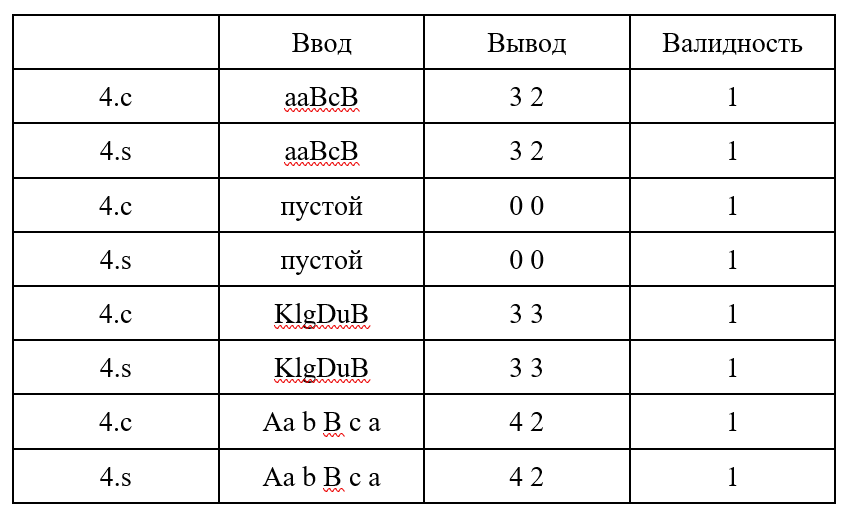

## Архитектура вычислительных систем
### Индивидуальное домашнее задание №2
##### Вариант 14


##### Котовский Семен Олегович, БПИ219
10 ноября 2022 г.


<b>Задание</b>: Разработать программу, вычисляющую отдельно число прописных и строчных букв в заданной ASCII-строке.

## Отчёт о выполнении

#### 4	балла
<li>	Приведено решение задачи на C.</li>

```c
#include <stdio.h>
#include <stdlib.h>

char *get_string(int *len, int *test) {
    *len = 0; 
    *test = 0;
    int capacity = 1; 
    char *s = (char*) malloc(sizeof(char)); 
    char c = getchar();
    if(c > 127){
      (*test)++;
    }  
    while (c != '\n') {
        s[(*len)++] = c; 
        if (*len >= capacity) {
            capacity *= 2; 
            s = (char*) realloc(s, capacity * sizeof(char)); 
        }

        c = getchar();
	if(c > 127){
          (*test)++;
        }          
    }
    s[*len] = '\0'; 
    return s; 
}

int main() {
    int len, test; 
    int a = 0;
    int A = 0;
    char *s = get_string(&len, &test);
    if(test == 0){
      for(int i = 0; i < len;i++){
        if((s[i] >= 65) && (s[i] <= 90)){
          A++;
        }
        else if((s[i] >= 97) && (s[i] <= 122)){
          a++;
        }
      }
      printf("lowercase: %d \nuppercase %d\n", a, A);
      return 0; 
    }
    else{
      printf("incorrect input");
      return 0;
    }
    free(s); 
    return 0;
}
```

Код находится в файле 4.c
Далее в командную строку вводим данные команды для получения искомого ассемблерного файла, а также исполняемого файла.
$gcc -O0 -Wall -fno-asynchronous-unwind-tables 4.c -o main
$gcc -O0 -Wall -fno-asynchronous-unwind-tables -S 4.c -o 4.s
$gcc 4.s -o
Необходимые комментарии находятся в 4.s



Представлено полное тестовое покрытие, дающее одинаковый результат на обоих программах.
После тестирования программ можно сделать вывод, что работа программы является корректной и эквивалентной.
<br>Примечание: для краткости в выводе не указаны слова lowercase и uppercase. Сначала выведено количество строчных, а затем прописных символов.
<br><br>
#### 5	баллов
<br>
В дополнение к требованиям на предыдущую оценку

•	В реализованной программе я использовал функции с передачей данных через параметры.
Функция counter принимает на вход указатель на начало строки, длину строки,
а также переменные, в которые будет сохранено количество строчных и заглавных символов.
Внутри функции реализован подсчёт количества соответствующих символов.

```c
#include <stdio.h>
#include <stdlib.h>

char *get_string(int *len, int *test) {
    *len = 0; 
    *test = 0;
    int capacity = 1; 
    char *s = (char*) malloc(sizeof(char)); 
    char c = getchar();
    if(c > 127){
      (*test)++;
    }  
    while (c != '\n') {
        s[(*len)++] = c; 
        if (*len >= capacity) {
            capacity *= 2; 
            s = (char*) realloc(s, capacity * sizeof(char)); 
        }

        c = getchar();
	if(c > 127){
          (*test)++;
        }          
    }
    s[*len] = '\0'; 
    return s; 
}
void counter(char *s, int len, int *a, int *A){
    for(int i = 0; i < len;i++){
        if((s[i] >= 65) && (s[i] <= 90)){
          (*A)++;
        }
        else if((s[i] >= 97) && (s[i] <= 122)){
          (*a)++;
        }
    }
}
int main() {
    int len, test; 
    int a = 0;
    int A = 0;
    char *s = get_string(&len, &test);
    if(test == 0){
      counter(s, len, &a, &A);
      printf("lowercase: %d \nuppercase %d\n", a, A);
      return 0; 
    }
    else{
      printf("incorrect input");
      return 0;
    }
    free(s); 
    return 0;
}
```

Измененная программа была сохранена в файле 5.c

##### Функциональность:
●	get_string(int *len, int *test) - получает на вход длину строки и переменную для проверки правильности ввода.
Внутри метода происходит проверка правильности ввода. Функция возвращает строку.

●	counter(char *s, int len, int *a, int *A) - получает на вход указатель на строку,
длину строки и переменные, в которых будет храниться количество строчных и прописных
букв. В функции подсчитывается количество соответствующих символов и записывается в соответствующие переменные.

##### Комментарии:
В ассемблерную программу при вызове функций были добавлены 
комментарии, которые описывают передачу фактических параметров и перенос возвращаемого результат, в случае когда функция ничего не возвращает был добавлен комментарий (void)
В этой программе не использовались формальные параметры.

#### 6 баллов
В дополнение к требованиям на предыдущую оценку
Я сделал рефакторинг программы на ассемблере за счет максимального использования регистров процессора. Измененная программа сохранена в файле “6.s”. В процессе рефакторинга соотвественно были изменены команды (например movl -> movq), а также были изменены регистры, которые контактировали с “новыми” регистрами (например: movl eax, -24(%rbp) -> movq rax, r12).
Также были добавлены комментарии, которые поясняют использование регистров в соответствии с переменными из исходной программы на С.


Представлено полное тестовое покрытие, дающее одинаковый результат на всех программах.

#### 7 баллов

Реализация программы на ассемблере, полученной после рефакторинга, в виде двух единиц компиляции (6-1.s & 6-2.s).

Я разделил код ассемблера на файл с функциями и файл с main. Далее скомпилировал полученные файлы и запустил файлы с исходными данными и файла для вывода результатов с использованием аргументов командной строки.

Далее я переделал файл Си, чтобы он брал и записывал данные из вводимых в командную строку файлов. (int argc, char * argv[]) измененная программа была сохранена под названием “7.c”


После чего эта программа была скомпилирована в 7.s.

Пример времени работы программы при различном кол-ве данных.


Также приведены файлы "lenXXX.txt" с заготовленными данными для тестов. Для запуска программы их необходимо переименовать в input.txt

#### 8 баллов

• В программу добавлен функционал для генерации случайных наборов данных.

Для корректной работы программы, запускать её необходимо с указанием одного из ключей (-h, -r, -f, -s)


Пример работы случайной генерации:


• Также реализована навигация в командной строке с выбором требуемых функций:

```c
else if(strcmp(argv[1], "-h") == 0){
    printf("-h Список функций\n");
    printf("-r Сгенерировать случайную строку\n");
    printf("-f считать входные данные из input.txt и вывести результат в output.txt\n");
    printf("-s считать строку из терминала и вывести в него результат\n");
  }
```

• Программа была модифицирована добавлением функционала для вычисления времени.


Время работы программы было увеличено при помощи искусственного выполнения цикла множественное число раз.

```c
void counter(char *s, int len, int *a, int *A){
	for(int j = 0; j < 100000;j++){
	  *a = 0;
	  *A = 0;
	  for(int i = 0; i < len;i++){
		if((s[i] >= 65) && (s[i] <= 90)){
		  (*A)++;
		}
		else if((s[i] >= 97) && (s[i] <= 122)){
		  (*a)++;
		}
	    }
	}
}
```

Пример работы с разными входными данными:


Финальная версия программы сохранена в 8.c
